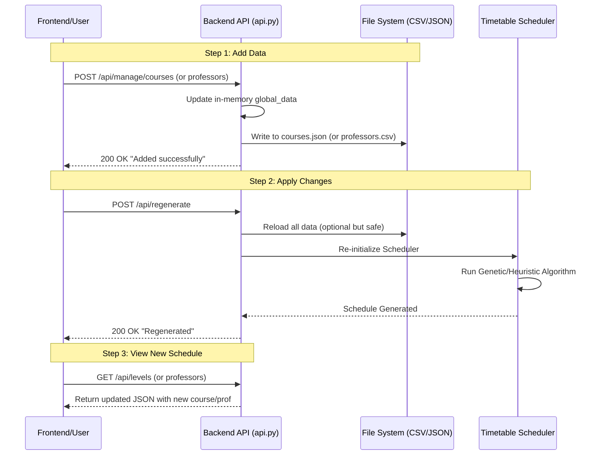

# Data Flow: Adding a Course or Professor

This document explains the lifecycle of a "Create" operation in the backend, from the initial API request to the updated timetable.

## The Flow

## Detailed Steps

### 1. The Add Request
*   **Action**: You send a `POST` request with the new data.
*   **Backend**:
    *   Validates the input.
    *   Adds the item to the running memory (`global_data`).
    *   **Immediately saves** the change to the permanent file (`courses.json` or `professors.csv`).
*   **Result**: The data is safe and persisted. However, **the schedule has NOT changed yet**. The new course exists in the database but hasn't been assigned a time or room.

### 2. Regeneration (The "Apply" Button)
*   **Action**: You must call the `/api/regenerate` endpoint.
*   **Backend**:
    *   Calls `initialize_scheduler()`.
    *   This clears the old schedule.
    *   It feeds all courses (including the new one) and professors into the scheduling algorithm.
    *   The algorithm runs to find conflict-free slots for everything.
*   **Result**: The `scheduler` object now contains a fresh timetable that includes your new additions.

### 3. Viewing the Result
*   **Action**: You call `GET /api/levels` or `GET /api/professors`.
*   **Backend**: Reads from the *current* `scheduler` object.
*   **Result**: You see the new course assigned to a specific time and room.
